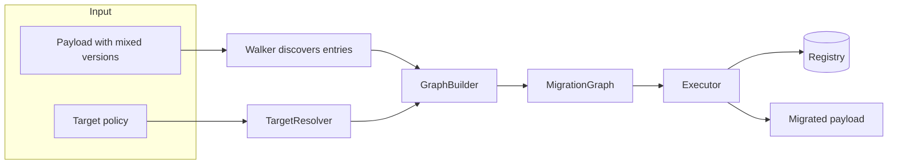
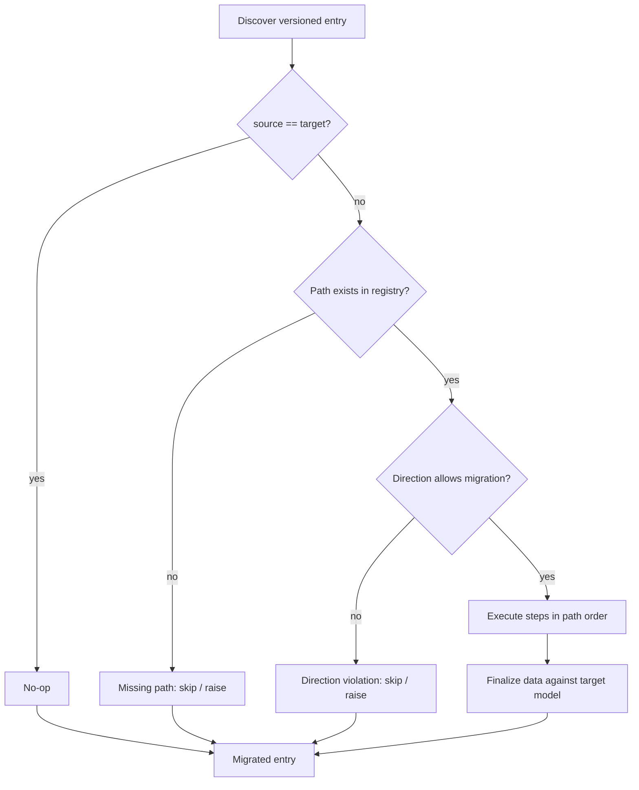
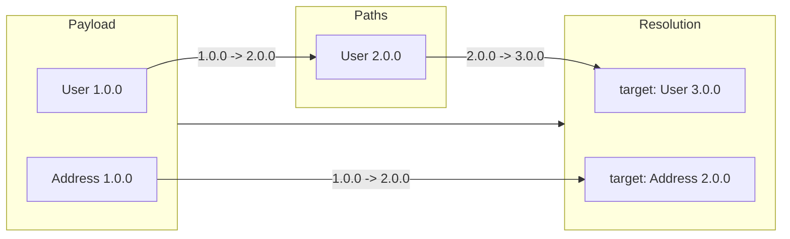

# Concepts

Modern data-driven systems manage a great variety of versioned data. With AI adoption, the evolution these systems have been accelerating at an exponential rate requiring a new approach to versioning of data flowing through the system.

## The problem

### Versioned data evolves

Your application stores structured data. Over time, the schema changes: fields
are added, removed, renamed, or retyped. Old records persist at their original
version. New records arrive at the current version. You end up with a mixed
population:

```
User 1.0.0: { name }
User 2.0.0: { name, email }
User 3.0.0: { name, email, role }
```

### Nested structures compound the problem

Real payloads are not flat. A `User` contains an `Address`. An `Order` contains
`LineItem`s. Each nested piece evolves independently:

```
User 1.0.0 {
  Address 1.0.0 { street, city }
}
```

Later:

```
User 2.0.0 {
  Address 2.0.0 { street, city, country }
}
```

A single payload can contain entries at multiple versions simultaneously.

### Migration is not just transformation

You need to:
- **Discover** every versioned entry in a payload (including deeply nested
  ones).
- **Resolve** what target version each entry should converge to (not always the
  latest).
- **Plan** the migration path (which intermediate versions to traverse).
- **Order** migrations correctly (children before parents).
- **Execute** safely (hooks, error handling, direction checks).
- **Finalize** against the target schema (validation, coercion).

Doing this manually is error-prone. Let's take a look at real-world scenarios.

## Real-world scenarios

### MCP tool schemas

An LLM tool platform exposes hundreds of tools. Each tool has an input schema
that evolves: a `search_weather` tool gains a `units` parameter, a
`create_ticket` tool renames `assignee` to `owner`. Old tool-call logs persist
at the original schema. New calls arrive at the current schema. When replaying
logs or auditing history, every call must converge to a common version for
analysis.

**Existing approaches:**
- Schema registry with backward-compatible changes only (Avro, Protobuf)
- Manual version branching in tool handlers
- Ad-hoc coercion in the LLM layer

### Message brokers

An event-driven system publishes `OrderCreated` events to Kafka. The event
schema evolves: `price` changes from integer cents to a decimal object,
`items` becomes a nested structure. Consumers must read old events and
interpret them at the current schema. The broker holds a mixed population
across partitions and retention windows.

**Existing approaches:**
- Schema Registry (Confluent) with compatibility rules
- Event upcasting (Axon, EventStoreDB)
- Consumer-side version branching
- Dual-writing during migration windows

### Configuration management

A SaaS app rolls out a new config schema: `feature_flags` becomes a map
instead of a list, `theme` splits into `light_theme` and `dark_theme`. Tenant
configs persist in the database at various versions. On each deployment, old
configs must converge to the current schema without losing data.

**Existing approaches:**
- Migration scripts per tenant (Flyway, Liquibase)
- Default-value coercion at read time
- Versioned config documents with manual reconciliation
- Shadow configs during rollout

### ETL pipelines

A data warehouse ingests records from multiple sources: a legacy CRM at schema
v1, a new API at schema v3, a partner feed at schema v2. The warehouse expects
a uniform schema. Each source record must normalize to the target version
before loading.

**Existing approaches:**
- Source-specific transformers (dbt, Airbyte)
- Staging tables with manual normalization
- Schema-on-read (Delta Lake, Iceberg)
- Custom ETL scripts per source

### IoT telemetry

Sensor gateways buffer telemetry during network outages. When connectivity
returns, the gateway uploads a batch of readings collected over hours. The
cloud schema may have advanced in the meantime: `temperature` gains a `unit`
field, `location` becomes a structured object. The ingestion pipeline must
converge all readings to the current schema for dashboards and alerts.

**Existing approaches:**
- Gateway-side schema embedding (each payload carries its schema)
- Time-windowed schema versions in the pipeline
- Fallback defaults for missing fields
- Replay-only pipelines for historical data

## The solution

### Philosophy

Schema evolution is inevitable. Data persists longer than code. The goal is not
to prevent version drift, but to embrace it: treat every piece of data as
belonging to a versioned family, and provide a systematic way to converge
mixed populations to a desired target.

### The challenge

Across MCP tools, message brokers, configuration management, ETL pipelines, and
IoT telemetry, the same challenges appear:

- **Discovery** — finding every versioned entry in a nested, heterogeneous
  payload without manual enumeration.
- **Target selection** — not every entry should migrate to the latest version;
  some are pinned, some are tenant-specific, some are legacy-only.
- **Ordering** — nested entries must migrate before their parents, but manual
  dependency tracking is error-prone.
- **Execution** — migrations must be safe (hooks, error handling, direction
  checks) and efficient (parallel where possible).
- **Finalization** — migrated data must validate against the target schema.

Existing solutions address pieces of this puzzle but leave gaps: schema
registries enforce compatibility but don't migrate data; event upcasting works
for events but not arbitrary payloads; migration scripts require manual
ordering; ETL transformers are source-specific.

### The pyverge approach

**Convergent migration.** The engine treats each entry independently. Given a
source version and a target version, it finds the registered migration path and
executes it. Entries converge to their targets regardless of where they
started.

**Dependency graph.** Nested entries are dependencies: a parent migration may
assume its children are already at the target version. The engine builds a
graph that captures this containment relationship and migrates in topological
order (children first).

**Policy-driven targets.** Not every entry migrates to the latest version. Some
legacy data is pinned to an older schema. Some tenants are on a different
track. The library accepts a declarative **target policy** and compiles it into
a resolver that answers, for each entry: *"what version should this converge
to?"*

**Provider-agnostic core.** Discovery, planning, and execution operate on plain
dicts. The only place a model library (Pydantic, dataclasses, etc.) is touched
is at the adapter seam. You can swap adapters without changing the engine.

The engine treats each entry independently. Given a source version and a target
version, it finds the registered migration path and executes it. Entries
converge to their targets regardless of where they started.

### Dependency graph

Nested entries are dependencies: a parent migration may assume its children are
already at the target version. The engine builds a graph that captures this
containment relationship and migrates in topological order (children first).

### Policy-driven targets

Not every entry migrates to the latest version. Some legacy data is pinned to
an older schema. Some tenants are on a different track. The library accepts a
declarative **target policy** and compiles it into a resolver that answers, for
each entry: *"what version should this converge to?"*

### Provider-agnostic core

Discovery, planning, and execution operate on plain dicts. The only place a
model library (Pydantic, dataclasses, etc.) is touched is at the adapter seam.
You can swap adapters without changing the engine.

## Execution flow



## Execution flow

The library automates the entire flow:

1. **Discover** every versioned entry in the payload (including deeply nested
   ones).
2. **Resolve** the target version for each entry based on the policy.
3. **Plan** the migration path and ordering (children before parents).
4. **Execute** migrations safely with hooks and error handling.
5. **Finalize** each entry against the target schema.


For every discovered entry the engine asks the resolver for a target, then
asks the registry for a migration path. The decision chain looks like this:



### Concrete example

A payload with two entries at different versions:



The walker finds both entries. The resolver picks targets. The graph builder
computes paths. The executor runs `Address 1.0.0 -> 2.0.0` first (child), then
`User 1.0.0 -> 2.0.0 -> 3.0.0` (parent).

## Target policy

A target policy answers one question for every discovered entry: *"what version
should this entry converge to?"* The policy is compiled into a lightweight
`TargetResolver` before the engine sees it.

```mermaid
flowchart TD
    subgraph Declarative forms
        A[None / skip]
        B[latest / earliest]
        C[explicit version string]
        D[model class or Versionable]
        E[per-kind mapping with wildcard]
    end

    Declarative forms -->|compile| R[TargetResolver]
    R -->|per entry| T[Target version]
    T --> Engine
```

| Form | Meaning |
| ---- | ------- |
| `None` or `"skip"` | Leave every entry unchanged. |
| `"latest"` / `"earliest"` | Converge to the registry extreme for the entry's kind. |
| version string (e.g. `"1.5.0"`) | Converge to the registered version matching the entry's kind. |
| model class or `Versionable` | Converge to the exact registered version represented by that class or node. |
| `dict` | Per-kind overrides; `"*"` is the fallback for any unlisted kind. |
| callable `TargetResolver` | External decision system; returned as-is. |

Per-kind mappings are useful when different model families in the same payload
need different convergence rules:

```python
manager.migrate(
    data,
    target={
        "LegacySensor": "1.5.0",  # pin legacy data explicitly
        "*": "latest",             # everything else moves forward
    },
)
```

> **Policy** — The migration engine is deliberately agnostic about what target
> version each payload entry should converge to. This module provides
> lightweight `TargetResolver` factories that the graph builder and the
> individual entry-migration strategies consume.
