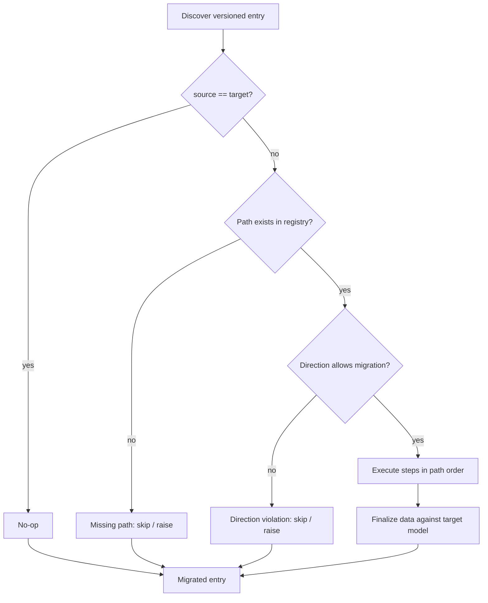
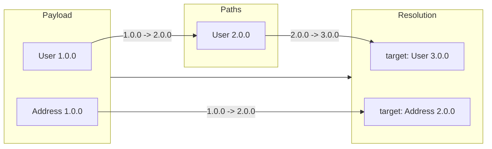

# Execution Flow

The library automates the entire flow:

1. **Discover** every versioned entry in the payload (including deeply nested
   ones).
2. **Resolve** the target version for each entry based on the policy.
3. **Plan** the migration path and ordering (children before parents).
4. **Execute** migrations safely with hooks and error handling.
5. **Finalize** each entry against the target schema.

For every discovered entry the engine asks the resolver for a target, then
asks the registry for a migration path. The decision chain looks like this:



## Concrete example

A payload with two entries at different versions:



The walker finds both entries. The resolver picks targets. The graph builder
computes paths. The executor runs `Address 1.0.0 -> 2.0.0` first (child), then
`User 1.0.0 -> 2.0.0 -> 3.0.0` (parent).

## Nested model structure

A nested versioned model — Person with Address and Contacts — illustrates how
containment drives discovery and ordering:

```
PersonContainer
└── document: Person (discriminator="version")
    ├── PersonV1 (version="1.0.0")
    │   ├── name: str
    │   └── address: Address
    │       ├── AddressV1 (version="1.0.0"): street, city
    │       └── AddressV2 (version="2.0.0"): +country?, +postal_code?
    │
    └── PersonV2 (version="2.0.0")
        ├── name: str
        ├── address: Address   (same discriminated union)
        ├── contacts: list[Contact]
        │   ├── ContactV1 (version="1.0.0"): phone
        │   └── ContactV2 (version="2.0.0"): +email?, +preferred="phone"
        └── AddressV3 (version="3.0.0"): +region?
```

The walker discovers every versioned entry at any depth. The graph builder
orders them so children migrate before their parents: `Address` and `Contact`
entries converge first, then the enclosing `Person`.
