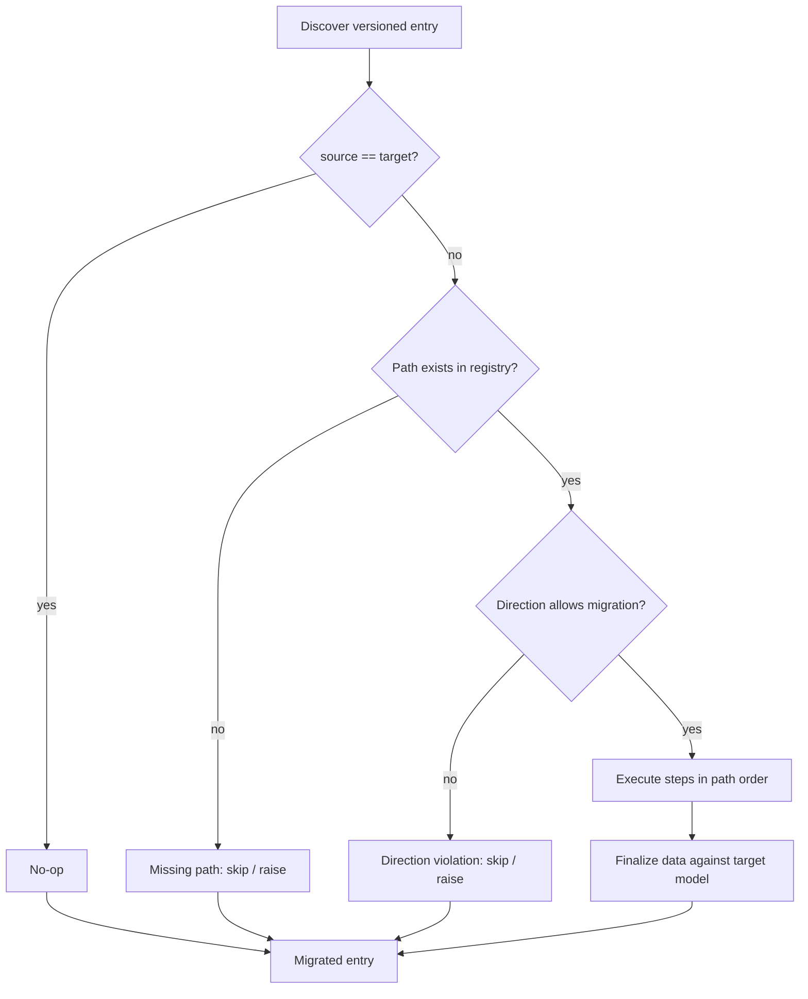
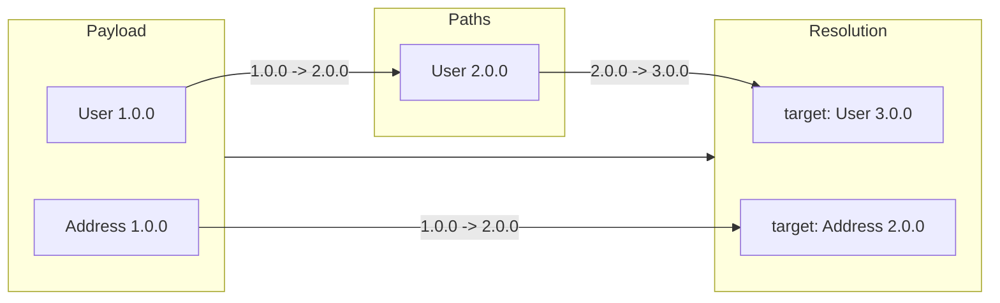

# Execution Flow

The library automates the entire flow:

1. **Discover** every versioned entry in the payload (including deeply nested
   ones).
2. **Resolve** the target version for each entry based on the policy.
3. **Plan** the migration path and ordering (children before parents).
4. **Execute** migrations safely with hooks and error handling.
5. **Finalize** each entry against the target schema.

For every discovered entry the engine asks the resolver for a target, then
asks the registry for a migration path. The decision chain looks like this:

## Concrete example

A payload with two entries at different versions:

The walker finds both entries. The resolver picks targets. The graph builder
computes paths. The executor runs `Address 1.0.0 -> 2.0.0` first (child), then
`User 1.0.0 -> 2.0.0 -> 3.0.0` (parent).
