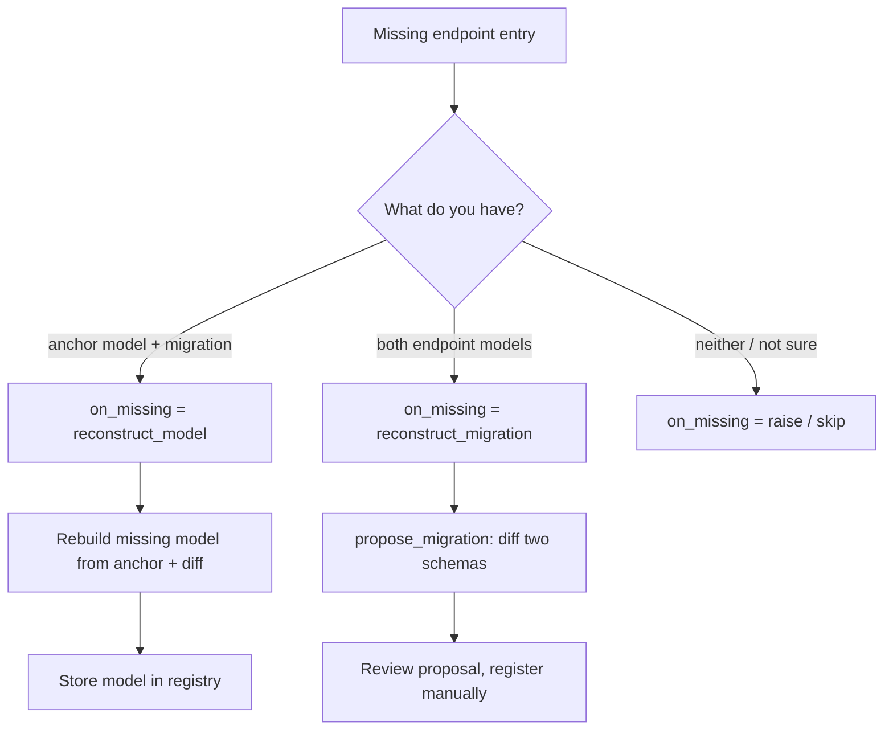

# Migrations

The engine converges every versioned entry in a payload along registered
migration paths. A complete chain needs two kinds of facts:

- a **model** per version (the concrete schema), and
- a **migration** per version edge (how to transform one version into the next).

You normally register both by hand. When one is missing, the engine can
reconstruct it — but only from the other, so the two reconstruction strategies
are **mutually exclusive**. Pick the one that matches *what you are missing*.

## Two mutually exclusive strategies

`on_missing` selects a single, **exclusive** fallback behavior for an edge
endpoint with no concrete entry. The two reconstruction strategies are inverses
and cannot be combined on one engine:

| Value | Axis | You have | Missing | Engine action |
| --- | --- | --- | --- | --- |
| `"reconstruct_model"` | per **migration** (with anchor model) | anchor model + migration | the other endpoint's model | rebuild it from the anchor and the diff, then store it |
| `"reconstruct_migration"` | per **model pair** | both endpoint models | the version-edge migration | diff the two schemas into a proposal |
| `"raise"` (default) | — | — | — | fail with `ModelNotFoundError` |
| `"skip"` | — | — | — | leave the version model-less |

Because the setting is exclusive, enabling one reconstruction path disables the
other. Choose based on which side of the pair your source of truth carries.



## Reconstructing a model (per migration edge)

A version chain can be represented as declarative patches against a single
latest model — for example, git-versioned JSON specs where only the latest
schema is kept and older versions exist only as patch deltas. Register the
anchor model and the migration; the engine materializes the missing endpoint
model from the anchor and the migration diff.

Enable the strategy in settings:

```python
from pyverge import Manager
from pyverge.migration import MigrationSettings, PydanticModelAdapter

UserManager = Manager[semver.Version].configure(
    MigrationSettings(on_missing="reconstruct_model"),
    PydanticModelAdapter(),
)
manager = UserManager()
```

Then register only the concrete model you have, plus the migration. The engine
reconstructs every missing version on registration:

```python
# Register the anchor model (the latest concrete schema).
manager.store_model(UserV2)

# Register a migration from an unregistered version.
# The engine reconstructs the 1.0.0 model from UserV2 minus the added field.
manager.store_migration(
    ("User", "1.0.0", "2.0.0"),
    JsonPatchMigration(
        {
            "from": "1.0.0",
            "to": "2.0.0",
            "ops": [{"op": "add", "path": "/age", "value": None}],
        }
    ),
)

# The 1.0.0 model is now materialized.
v1 = manager.get("User", "1.0.0")
assert v1.model is not None  # fields: kind, version, name
```

When a migration is registered, the engine checks both endpoints against the
registry:

- A **registered** endpoint (with a concrete model) is used as-is.
- An **unregistered** endpoint is reconstructed from the other endpoint's model
  and the migration's diff, then stored in the registry.

The reconstructed model is a real, concrete model — it can be validated
against, introspected, or served with a version-accurate schema. This strategy
**mutates the registry**.

With the default `on_missing="raise"`, registering a migration with an
unregistered endpoint raises `ModelNotFoundError`.

## Reconstructing a migration (per model pair)

The inverse case: you have both concrete models but no migration between them.
Diff the two schemas and render the result as a declarative RFC 6902 spec:

```python
# Both models must be registered (and carry concrete models).
user_v1 = manager.get("User", "1.0.0")
user_v2 = manager.get("User", "2.0.0")

# Diff the two schema versions into a declarative proposal.
proposal = manager.engine.propose_migration(user_v1, user_v2)

# The proposal is a JsonPatchMigration — review it before registering.
manager.store_migration(("User", "1.0.0", "2.0.0"), proposal)
```

The proposal is a **shape-based** diff: it captures field additions, removals
and type changes, but cannot infer business intent (renames, value remaps).
Treat it as a template to edit, never as auto-registered truth.

Unlike model reconstruction, `propose_migration` **never auto-registers** and
**never touches endpoint models** — it returns a proposal you review and
register deliberately.

## Migration formats

Migrations can be Python callables or declarative RFC 6902 JSON Patch specs.
Both are normalized into a diff by the engine's discovery strategies, so
reconstruction works the same way regardless of format:

```python
# Python callable
manager.store_migration(("User", "1.0.0", "2.0.0"), add_age)

# Declarative JSON Patch spec
manager.store_migration(
    ("User", "1.0.0", "2.0.0"),
    JsonPatchMigration(
        {
            "from": "1.0.0",
            "to": "2.0.0",
            "ops": [{"op": "add", "path": "/age", "value": None}],
        }
    ),
)
```

## Backward migration

Backward migration across a chain works by registering a reverse edge with
`from`/`to` swapped and its own ops:

```python
# Forward edge: 0.1.0 -> 0.2.0
manager.store_migration(("User", "0.1.0", "0.2.0"), forward_ops)

# Reverse edge: 0.2.0 -> 0.1.0 (swapped spec, own ops)
manager.store_migration(("User", "0.2.0", "0.1.0"), reverse_ops)
```

Without a registered reverse edge, a backward migration raises.
